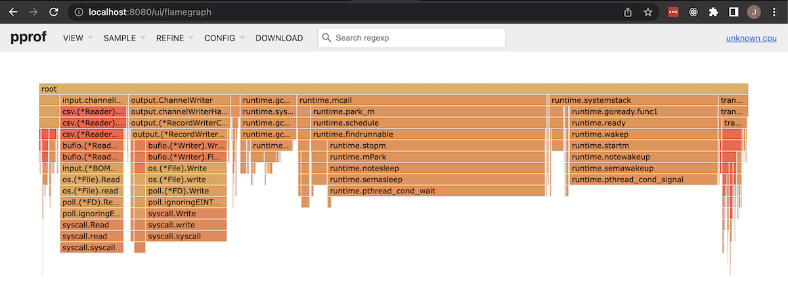
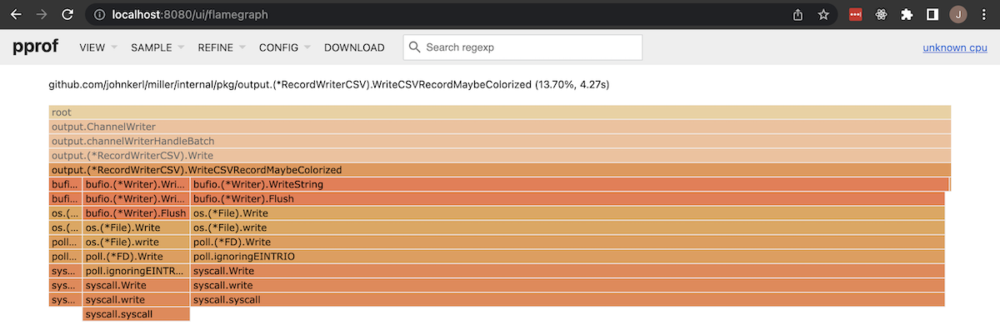

# See also

* [https://github.com/johnkerl/miller/blob/readme-profiling/README-dev.md#performance-optimizations](https://github.com/johnkerl/miller/blob/readme-profiling/README-dev.md#performance-optimizations)
* [https://miller.readthedocs.io/en/latest/new-in-miller-6/#performance-benchmarks](https://miller.readthedocs.io/en/latest/new-in-miller-6/#performance-benchmarks).
* `make bench` to run Go benchmarks for Miller

# How to view profile data

Run the profiler:

```
mlr --cpuprofile cpu.pprof --csv put -f scripts/perf/chain-1.mlr ~/data/big.csv > /dev/null
```

(or whatever command-line flags for Miller).

Text mode:

```
go tool pprof mlr cpu.pprof
top10
```

Graphical mode:

```
go tool pprof -http=:8080 cpu.pprof
```

and let it pop open a browser window. Then navigate there -- I personally find _View_ -> _Flame Graph_ most useful:



Note that you can drill into subcomponents of the flame graph:



# Benchmark scripts

Scripts:

* [./scripts/perf/prep-perf-data.sh](./scripts/perf/prep-perf-data.sh) -- Create million-record data files in various formats.
* [./scripts/perf/time-verbs.py](./scripts/perf/time-verbs.py) -- Run a few processing scenarios on the million-record CSV file.
  * One batch of cases times various Miller verbs.
  * A second batch of cases runs `mlr cat` for million-record files of various file formats. Catting files isn't intrinsically interesting but it shows how input and output processing vary over file formats.
  * A third batch of cases runs longer and longer chains of `scripts/perf/chain-1.mlr`, showing how Miller handles multicore and concurrency.
* [./scripts/perf/make-data-stream](./scripts/perf/make-data-stream) -- Create an endless stream of data to be piped into Miller for steady-state load-testing: e.g. `scripts/perf/make-data-stream | mlr ...` then look at `htop` in another window.

Notes:

* Any of the above can be run using the profiler. I find Flame Graph mode particularly informative for drill-down.
* The above refer to `mlr5` and `~/tmp/miller/mlr` as well as `./mlr`. The idea is I have a copy of Miller 5.10.3 (the C implementation) saved off in my path as `mlr5`. Then I keep `~/tmp/miller` on recent HEAD. Then I have `.` on a dev branch. Comparing `mlr5` to `./mlr` shows relative performance of the C and Go implementations. Comparing `~/tmp/miller/mlr` to `./mlr` shows relative performance of whatever optimization I'm currently working on.
* Several of the above scripts use [justtime](https://github.com/johnkerl/scripts/blob/main/fundam/justtime) to get one-line timing information.

# How to vary compiler versions

* [./scripts/perf/compiler-versions-install](./scripts/compiler-versions-install)
* [./scripts/perf/compiler-versions-build](./scripts/compiler-versions-build)
* [./scripts/perf/compiler-versions-time](./scripts/compiler-versions-time)

# How to control garbage collection

```
# Note 100 is the default
# Raise the bar for GC threshold:
GOGC=200  GODEBUG=gctrace=1 mlr -n put -q -f u/mand.mlr 1> /dev/null

# Raise the bar higher for GC threshold:
GOGC=1000 GODEBUG=gctrace=1 mlr -n put -q -f u/mand.mlr 1> /dev/null

# Turn off GC entirely and see where time is spent:
GOGC=off  GODEBUG=gctrace=1 mlr -n put -q -f u/mand.mlr 1> /dev/null
```
